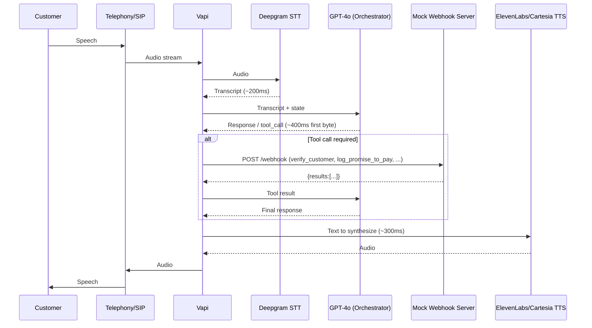
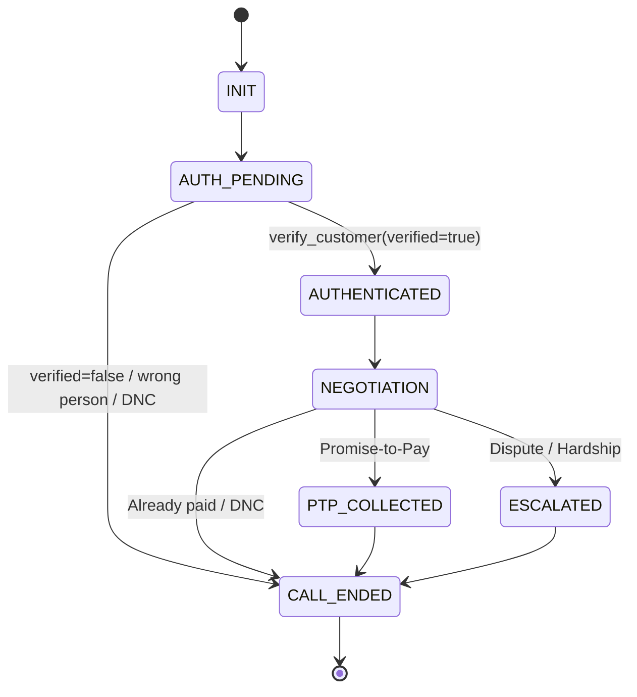

# HLD — Maya Voice AI Collections Agent (Kapture Finance)

## 1. Pipeline & Latency Budget

| Component        | Target    |
|-------------------|----------:|
| STT (Deepgram)     | ~200 ms  |
| LLM first byte     | ~400 ms  |
| TTS synthesis       | ~300 ms  |
| Network overhead    | ~200 ms  |
| **Total**            | **< 1.2 s** |

## 2. State Machine

**Rule:** `AUTH_PENDING -> AUTHENTICATED` transitions ONLY on a `verify_customer` response with `verified: true`. No debt-related terms (overdue, loan, EMI, amount, debt, payment due) may be emitted by the LLM prior to this transition.

## 3. Intents & Entities

**Intents:** `Confirm_Identity`, `Promise_To_Pay`, `Hardship_Claim`, `Dispute_Debt`, `Already_Paid`, `Request_DNC`, `Wrong_Person`

**Entities:** `PTP_Date` (ISO-8601), `PTP_Amount`, `Hardship_Reason`, `Verification_Code`

## 4. Tool/API Specifications

| Tool | Purpose | Key Params | Response |
|---|---|---|---|
| `verify_customer` | Gate for debt disclosure | account_id, verification_code | `{verified, message}` |
| `log_promise_to_pay` | Store PTP commitment | account_id, ptp_date, amount | `{success, ptp_id, confirmed_date, amount}` |
| `send_payment_link` | Send mock payment link | account_id, channel | `{success, message}` |
| `escalate_to_agent` | Human handoff | reason (HARDSHIP_REQUEST/DISPUTE) | `{success, escalation_id}` |
| `mark_disposition` | Log final outcome | account_id, status, notes | `{success, status, logged_at}` |

Full JSON schemas: `vapi/tool_definitions.json`. Implementation: `mock-server/server.js`.

## 5. Authentication & Data Safety

- Debt terms are withheld at the **prompt level** (system prompt hard rule) and enforced procedurally by the state machine — disclosure copy only exists in the `AUTHENTICATED` branch of the flow.
- Verification codes accepted in the mock: `1234`, `1995` (configurable via `MOCK_VALID_CODES`). No real PAN/DOB is used or stored.
- All PII in server logs is masked (e.g., `Rahul S****`) via `maskName()`.
- Debt information is never disclosed to a third party (wrong-person path never reaches AUTHENTICATED).

## 6. Compliance & Guardrails

- Calling window: 08:00–19:00 local time (documented; enforced by the calling scheduler in a real deployment, out of scope for this mock).
- DNC requests honored immediately, call terminated right after `mark_disposition(DO_NOT_CALL)`.
- No unauthorized discounts/waivers > 10%; hardship cases are escalated, not resolved by the bot.
- Tone constraints (never threaten/argue/insult/pressure) enforced via system prompt.

## 7. Edge Cases Matrix

| Case | Trigger | Tool Call | Disposition |
|---|---|---|---|
| Wrong person | Not Rahul / unavailable | mark_disposition | WRONG_PERSON |
| Verification failure | Wrong code | verify_customer | (no disposition; safe end) |
| Already paid | "I already paid" | mark_disposition | ALREADY_PAID |
| Hardship | "Can't pay" | escalate_to_agent, mark_disposition | HARDSHIP_ESCALATED |
| Dispute | "Not my debt" | escalate_to_agent, mark_disposition | DISPUTED |
| DNC | "Stop calling" | mark_disposition | DO_NOT_CALL |
| Silence | No response x2 | mark_disposition | NO_RESPONSE |
| Abusive customer | Repeated abuse | mark_disposition | (soft hangup, appropriate status) |
| PTP | Agrees to pay | log_promise_to_pay, send_payment_link, mark_disposition | PTP_AGREED |

## 8. Observability Metrics

- **Containment Rate** = calls resolved without `escalate_to_agent` / total calls.
- **PTP Rate** = calls ending `PTP_AGREED` / total calls.
- **First Call Resolution** = calls with a valid final `mark_disposition` / total calls.
- Per-call technical log fields: tool name, success/failure, call state, final disposition, latency, error info. PII excluded/masked.
